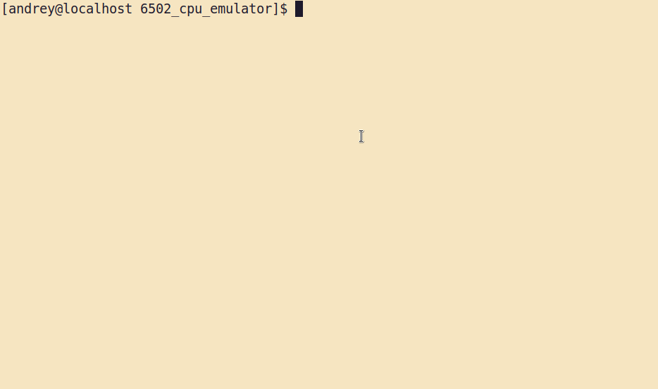
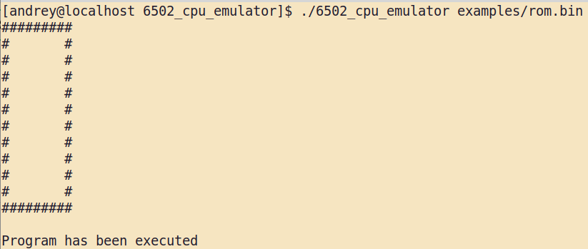

# 6502 Cpu assembler sandbox

A simple project for everyone having interest to learn an assembler of 6502 Cpu.


## Installation

To use it you need to install cc65.

cc65 is tools to compile, link and make binary rom file.

```bash
git clone https://github.com/cc65/cc65.git
cd cc65
make
```
Source https://cc65.github.io/getting-started.html
## Usage/Examples

first, write a simple program using assembler.

hello_world.asm
```
.SEGMENT "RESET"
.WORD $8000

.SEGMENT "CODE"
LDY $00
LDA Message, Y

Loop:
STA $2000
INY
LDA Message, Y
CMP $0A
BNE Loop

STA $2000
NOP

Message:
.BYTE "Hello World!", $0A
```

Then add section in Makefile
```
hello_world:
	ca65 --cpu 6502 hello_world.asm
	ld65 -C linker.ld --obj hello_world.o -o rom.bin
```

After that you can make a binary rom using 
`make hello_world` iside the examples folder.

As a result you may see rom.bin file to run it inside the emulator.

Just run `./6502_cpu_emulator examples/rom.bin`.
## Screenshot of rectangle program




